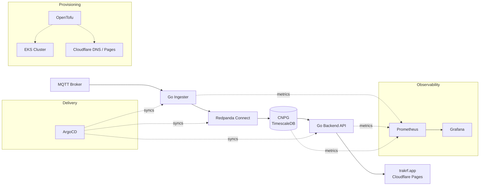

# TrakRF Infrastructure

[](https://github.com/trakrf/infra/actions/workflows/ci.yml)

Production-style infrastructure for the TrakRF IoT telemetry platform: MQTT ingestion, a PostgreSQL/TimescaleDB time-series store, and a Go API — deployed on EKS via GitOps, observed with Prometheus and Grafana, provisioned with OpenTofu.

This repo is public on purpose. It's a working reference for how we build: small pieces, explicit decisions, nothing magic.

## Architecture



Sensors publish MQTT to a broker. A Go **ingester** forwards messages to **Redpanda Connect**, which transforms and writes them into **CloudNativePG** (CNPG) running **TimescaleDB**. A Go **backend API** serves the data to `trakrf.app`. **kube-prometheus-stack** scrapes everything; **ArgoCD** reconciles workloads from this repo; **OpenTofu** provisions the underlying cloud.

## Why this architecture

Decisions we made, and why:

- **EKS over self-managed k8s or ECS** — Managed control plane eliminates an entire class of ops work. ECS is simpler but locks us into AWS primitives; k8s keeps the door open to GKE/AKS/on-prem later.
- **CloudNativePG over CrunchyData PGO** — CNPG is lighter, Kubernetes-native, and its bootstrap lets us scope role grants to a specific schema. The CrunchyData operator is more featureful but heavier than we need for a single tenant.
- **ArgoCD over Flux** — The UI is worth something for a portfolio project and for on-call debugging. App-of-apps pattern keeps the manifests discoverable.
- **Helm charts committed in-repo** — `helm/trakrf-backend`, `helm/trakrf-ingester`, and `helm/monitoring` are versioned alongside the infra that deploys them. No surprise upgrades from upstream registries.
- **kube-prometheus-stack installed via Helm, not ArgoCD** — Tried ArgoCD first; webhook admission + server-side apply interactions made it fragile. The CRD-heavy chart is happier as a direct `helm upgrade`. ArgoCD still manages the application workloads.
- **Two OpenTofu roots** — `terraform/cloudflare/` and `terraform/aws/` can be applied independently. The seam keeps the DNS/edge layer portable if we ever want to front a different cloud.
- **OpenTofu over Terraform** — Licensing. Same HCL, open governance.

## Repo tour

| Path | Purpose |
|---|---|
| `terraform/bootstrap/` | One-time Cloudflare setup: R2 state bucket, API tokens. |
| `terraform/cloudflare/` | DNS, Pages, email, alt-domain delegation. |
| `terraform/aws/` | VPC, EKS, ECR, IAM/IRSA, Route53 records. |
| `terraform/gcp/` | Placeholder for a future GCP region. |
| `helm/trakrf-backend/` | Go API chart (includes migration job). |
| `helm/trakrf-ingester/` | MQTT ingester chart. |
| `helm/monitoring/` | `kube-prometheus-stack` values, dashboards, out-of-chart manifests (CNPG `ServiceMonitor`). |
| `argocd/` | Bootstrap values, project, root app-of-apps, per-workload `Application`s. |
| `docs/superpowers/specs/` | Design docs per milestone / ticket. |
| `docs/superpowers/plans/` | Implementation plans executed against those specs. |
| `justfile` | Top-level task runner. |

## Quick start

Prereqs: OpenTofu, Helm, `kubectl`, `just`, `aws` CLI, `direnv`, an AWS account, a Cloudflare account, and a `.env.local` populated with the usual suspects (`CLOUDFLARE_ACCOUNT_ID`, `DOMAIN_NAME`, `CLOUDFLARE_BOOTSTRAP_API_TOKEN`, `AWS_PROFILE`, etc.).

```bash
# 1. One-time: create R2 state bucket + scoped API tokens in Cloudflare
just bootstrap

# 2. Provision Cloudflare DNS/Pages/email
just cloudflare

# 3. Provision AWS: VPC, EKS, ECR, IAM/IRSA
just aws

# 4. Point kubectl at the new cluster
aws eks update-kubeconfig --name trakrf --region us-east-2

# 5. Install ArgoCD and apply the root app-of-apps
just argocd-bootstrap
just argocd-password        # initial admin password
just argocd-ui              # port-forward to :8080

# 6. Install the observability stack (Prometheus + Grafana + dashboards)
just monitoring-bootstrap
just grafana-password
just grafana-ui             # port-forward to :3000
```

ArgoCD will sync `trakrf-ingester`, `trakrf-backend`, and the CNPG `Cluster` automatically. Database role secrets (`trakrf-app-credentials`, `trakrf-migrate-credentials`) must be created out-of-band — see [`helm/README.md`](helm/README.md).

## Observability

Five dashboards ship with the monitoring stack. Screenshots from the live cluster:

**Grafana — dashboard index**


**CloudNativePG — cluster health, replication lag, WAL throughput**


**Redpanda Connect — pipeline throughput and errors**


**Kubernetes cluster overview — nodes, pods, resource pressure**


**Prometheus targets — scrape health across the cluster**


## Production considerations

What's demo-grade today vs. what production would need:

- **High availability** — Single-AZ node group to keep demo cost down. Production wants ≥2 AZs, multi-AZ CNPG, and a PDB on each workload.
- **Autoscaling** — No HPAs yet. Backend and ingester are CPU-bound under load; add HPAs before any real traffic.
- **Backup / DR** — CNPG supports `barmanObjectStore` to S3; not configured. Production needs continuous WAL archival plus scheduled base backups, and a documented restore drill.
- **Secrets management** — Kubernetes `Secret`s today. Planned: External Secrets Operator against AWS Secrets Manager.
- **Authentication** — No user auth on Grafana/ArgoCD beyond the built-in admins. Planned: Kanidm as IdP with OIDC into both.
- **Network policy** — None yet. Production wants default-deny plus explicit allow between namespaces.
- **Image supply chain** — Images are pinned by digest in values files. No Cosign verification in the cluster yet.
- **Ingress / TLS** — Designed in [`docs/superpowers/specs/`](docs/superpowers/specs/); not yet deployed.

## Cost

Rough order-of-magnitude (us-east-2, on-demand):

- **Demo (current)** — single `t3.medium` node group, single-AZ, minimal EBS, one NAT gateway. Expect **~$120–$160/month**; NAT is the majority.
- **Production target** — multi-AZ `m7i.large` node group (3 nodes), multi-AZ NAT, CNPG with dedicated node pool, S3 backups, ALB. Expect **~$600–$900/month** before data transfer. Long poles: NAT egress, ALB, EBS.

Numbers are estimates — confirm against the [AWS pricing calculator](https://calculator.aws/) for your workload.

## Status & roadmap

This repo is part of M1 (infrastructure foundation) of the TrakRF SaaS MVP. Subsequent milestones add ingress/TLS, a Kanidm-backed IdP, and multi-AZ hardening.

## Contributing & policies

- [CONTRIBUTING.md](CONTRIBUTING.md)
- [CODE_OF_CONDUCT.md](CODE_OF_CONDUCT.md)
- [SECURITY.md](SECURITY.md)
- [LICENSE](LICENSE)
