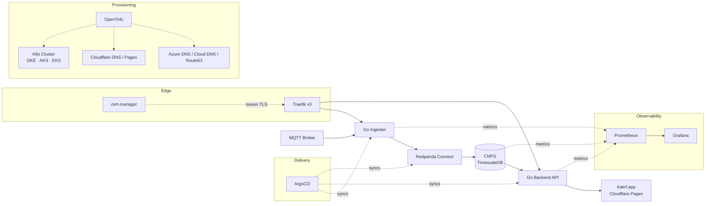
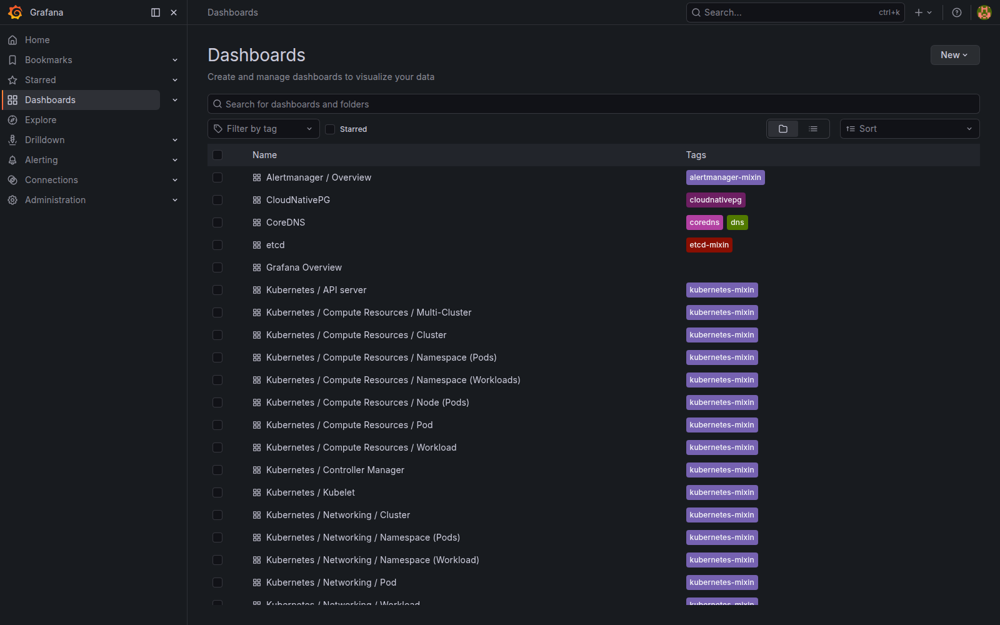
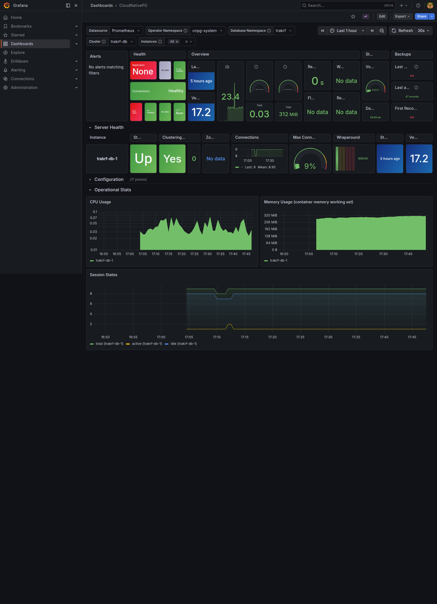
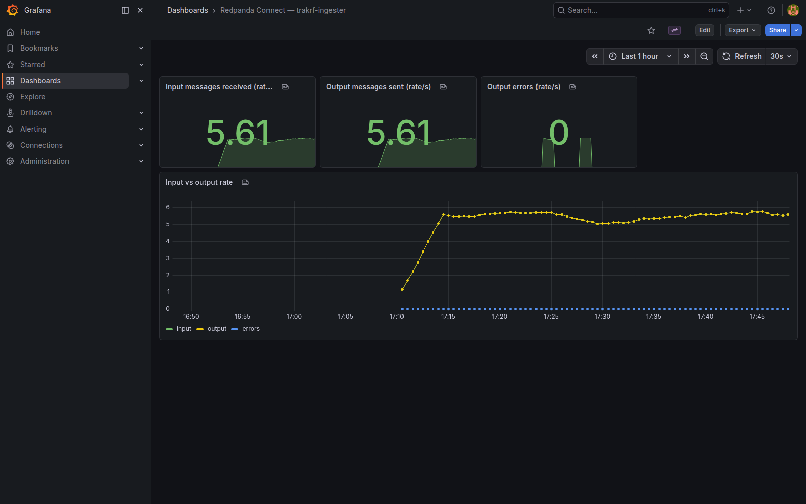
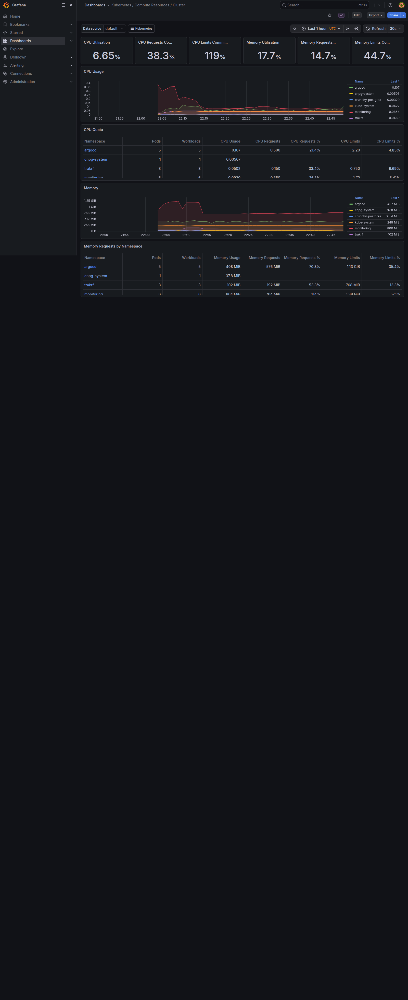
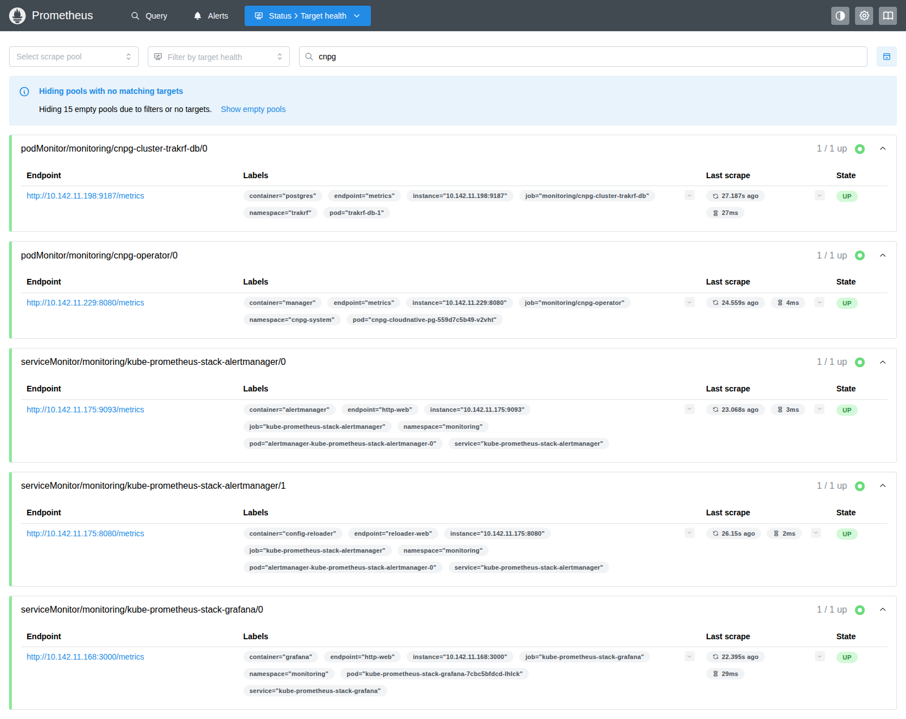

# TrakRF Infrastructure

[](https://github.com/trakrf/infra/actions/workflows/ci.yml)

Production-style infrastructure for the TrakRF IoT telemetry platform: MQTT ingestion, a PostgreSQL/TimescaleDB time-series store, and a Go API — deployed to managed Kubernetes (GKE active, AKS stopped, EKS deprovisioned; all three paths supported) via GitOps, observed with Prometheus and Grafana, provisioned with OpenTofu.

A single `cluster` flag swaps the active target. Per-cluster overlays under each Helm chart (`values-aks.yaml`, `values-gke.yaml`, …) carry the cloud-specific bits — DNS solver, load-balancer IP, workload identity — so the same workloads land cleanly on either cloud.

This repo is public on purpose. It's a working reference for how we build: small pieces, explicit decisions, nothing magic.

## Architecture



Sensors publish MQTT to a broker. A Go **ingester** forwards messages to **Redpanda Connect**, which transforms and writes them into **CloudNativePG** (CNPG) running **TimescaleDB**. A Go **backend API** serves the data to `trakrf.app`. **Traefik v3** fronts the cluster with **cert-manager** issuing wildcard certs via DNS-01 (Azure DNS on AKS, Cloud DNS on GKE — both authenticated by workload identity, no static credentials). **kube-prometheus-stack** scrapes everything; **ArgoCD** reconciles workloads from this repo using an app-of-apps **root chart** that re-parents per cluster; **OpenTofu** provisions the underlying cloud.

## Why this architecture

Decisions we made, and why:

- **Managed Kubernetes over self-managed k8s or proprietary container runtimes** — Managed control planes eliminate an entire class of ops work. ECS/Cloud Run/ACI lock you into per-cloud primitives; k8s keeps the door open to a second (or third) cloud.
- **Multi-cloud across EKS, AKS, and GKE** — Started on EKS, then ported to AKS (TRA-438) and GKE (TRA-461) to prove the workload is portable and to land where the credits are. GKE is the active cluster; AKS is stopped (resources kept, can be started back up quickly); EKS is deprovisioned (state preserved, rebuilds from `just aws`). All three remain first-class targets — useful as templates if you want to self-host this stack on a specific cloud. Cluster-specific bits live in `values-<cluster>.yaml` overlays so the same chart deploys on any of the three.
- **App-of-apps root chart with cluster overlay** — `argocd/root/` is a thin Helm chart that emits one `Application` per workload (`cert-manager`, `traefik`, `trakrf-db`, `trakrf-backend`, `trakrf-ingester`, …). Tofu outputs (workload-identity client IDs, static LB IPs, DNS zone names) are injected at install time by `scripts/apply-root-app.sh <cluster>`.
- **Traefik + cert-manager with workload-identity DNS-01** — Wildcard cert via DNS-01, federated to Azure UAI / GCP service account, no API keys at rest. Static load-balancer IP provisioned in Terraform and pinned to Traefik via the cluster overlay.
- **CloudNativePG over CrunchyData PGO** — CNPG is lighter, Kubernetes-native, and its bootstrap lets us scope role grants to a specific schema. The CrunchyData operator is more featureful but heavier than we need for a single tenant.
- **ArgoCD over Flux** — The UI is worth something for a portfolio project and for on-call debugging. App-of-apps pattern keeps the manifests discoverable.
- **Helm charts committed in-repo** — `helm/trakrf-backend`, `helm/trakrf-ingester`, `helm/monitoring`, `helm/cert-manager-config`, `helm/traefik-config`, `helm/cnpg`, `helm/trakrf-db` are versioned alongside the infra that deploys them. No surprise upgrades from upstream registries.
- **kube-prometheus-stack and CNPG installed via Helm, not ArgoCD** — Tried ArgoCD first for kube-prometheus; webhook admission + server-side apply interactions made it fragile. CRD-heavy charts are happier as a direct `helm upgrade`. ArgoCD still manages the application workloads.
- **Per-cloud OpenTofu roots** — `terraform/cloudflare/`, `terraform/aws/`, `terraform/azure/`, `terraform/gcp/` apply independently. The seam keeps the DNS/edge layer portable and lets each cloud move at its own pace.
- **OpenTofu over Terraform** — Licensing. Same HCL, open governance.

## Repo tour

| Path | Purpose |
|---|---|
| `terraform/bootstrap/` | One-time Cloudflare setup: R2 state bucket, API tokens. |
| `terraform/cloudflare/` | DNS, Pages, email, alt-domain delegation. |
| `terraform/aws/` | VPC, EKS, ECR, IAM/IRSA, Route53 records. Currently deprovisioned (TRA-381, 2026-04-21) — rebuild with `just aws`. |
| `terraform/azure/` | AKS, ACR, Azure DNS, user-assigned identities, static traefik PIP, cert-manager identity federation. AKS cluster is currently stopped to hold cost; resources retained. |
| `terraform/gcp/` | GKE, Cloud DNS, Artifact Registry, GSAs + Workload Identity, static traefik LB IP. Active cluster. |
| `helm/cnpg/` | CloudNativePG operator values (per-cluster overlays). |
| `helm/trakrf-db/` | CNPG `Cluster` for the `trakrf` namespace. |
| `helm/trakrf-backend/` | Go API chart (includes migration job). |
| `helm/trakrf-ingester/` | MQTT ingester chart. |
| `helm/cert-manager-config/` | `ClusterIssuer` + wildcard `Certificate` per cluster (Cloudflare, Azure DNS, or Cloud DNS solver). |
| `helm/traefik-config/` | `IngressClass`, default middlewares, TLS store wired to the wildcard secret. |
| `helm/monitoring/` | `kube-prometheus-stack` values, dashboards, out-of-chart manifests (CNPG `ServiceMonitor`, per-cluster Grafana `IngressRoute`). |
| `argocd/bootstrap/` | ArgoCD chart values (per-cluster overlays). |
| `argocd/root/` | App-of-apps Helm chart — one `Application` per workload, parameterized per cluster. |
| `argocd/projects/` | `AppProject` definitions. |
| `scripts/apply-root-app.sh` | Templates `argocd/root/values.yaml` from tofu outputs and installs the root app. |
| `scripts/smoke-{aks,gke}.sh` | Post-bootstrap precondition checks. |
| `docs/superpowers/specs/` | Design docs per milestone / ticket. |
| `docs/superpowers/plans/` | Implementation plans executed against those specs. |
| `justfile` | Top-level task runner. |

## Quick start

Prereqs: OpenTofu, Helm, `kubectl`, `just`, `direnv`, the cloud CLI(s) you intend to target (`az` + `kubelogin` for AKS, `gcloud` + `gke-gcloud-auth-plugin` for GKE), a Cloudflare account, and a `.env.local` populated with the usual suspects (`CLOUDFLARE_ACCOUNT_ID`, `DOMAIN_NAME`, `CLOUDFLARE_BOOTSTRAP_API_TOKEN`, plus per-cloud creds).

The flow below targets GKE; substitute `aks` to land on Azure instead. Per-chart overlays handle the rest.

```bash
# 1. One-time: create R2 state bucket + scoped API tokens in Cloudflare
just bootstrap

# 2. Provision Cloudflare (apex DNS, Pages, email, alt-domain delegation)
just cloudflare

# 3. Provision the target cloud (pick one)
just gcp                    # GKE, Cloud DNS, Artifact Registry, WI service accounts
# just azure                # AKS, ACR, Azure DNS, UAIs, static traefik PIP

# 4. Point kubectl at the new cluster
just gke-creds              # or: just aks-creds

# 5. Install the CNPG operator + create namespace and DB role secrets
just cnpg-bootstrap gke
just db-secrets
just ingester-secrets

# 6. Install ArgoCD and the trakrf-root app-of-apps for this cluster
just argocd-bootstrap gke
just argocd-password        # initial admin password
just argocd-ui              # port-forward to :8080

# 7. Install the observability stack (Prometheus + Grafana + dashboards)
just monitoring-bootstrap gke
just grafana-password
just grafana-ui             # port-forward to :3000
```

ArgoCD will sync `cert-manager`, `traefik`, the CNPG `Cluster`, `trakrf-backend`, and `trakrf-ingester` automatically. The `db-secrets` and `ingester-secrets` recipes create the role/MQTT credentials that have to exist before the workloads come up — see [`helm/README.md`](helm/README.md).

> **Note on root chart edits.** Changes under `argocd/root/templates/*` don't auto-sync — they require re-running `scripts/apply-root-app.sh <cluster>` to bump the root chart and re-template the tofu outputs.

## Observability

Five dashboards ship with the monitoring stack. Screenshots from the live cluster:

**Grafana — dashboard index**


**CloudNativePG — cluster health, replication lag, WAL throughput**


**Redpanda Connect — pipeline throughput and errors**


**Kubernetes cluster overview — nodes, pods, resource pressure**


**Prometheus targets — scrape health across the cluster**


## Production considerations

What's demo-grade today vs. what production would need:

- **Ingress / TLS** — ✅ Traefik v3 + cert-manager with DNS-01 wildcard, federated to a per-cloud workload identity (Azure UAI on AKS, GSA on GKE). No static credentials in the cluster.
- **High availability** — Single-zone node pool to keep demo cost down. Production wants ≥2 zones, multi-AZ CNPG, and a PDB on each workload. CNPG node pinning pattern (dedicated node group, taint+label) is in place on the EKS lineage and ready to port.
- **Autoscaling** — No HPAs yet. Backend and ingester are CPU-bound under load; add HPAs before any real traffic.
- **Backup / DR** — CNPG supports `barmanObjectStore` to object storage; not configured. Production needs continuous WAL archival plus scheduled base backups, and a documented restore drill.
- **Secrets management** — Kubernetes `Secret`s today. Planned: External Secrets Operator against the cloud's native KMS-backed store (AWS Secrets Manager / Azure Key Vault / GCP Secret Manager) so the per-cluster overlay handles it.
- **Authentication** — No user auth on Grafana/ArgoCD beyond the built-in admins. Planned: Kanidm as IdP with OIDC into both.
- **Network policy** — None yet. Production wants default-deny plus explicit allow between namespaces.
- **Image supply chain** — Images are pinned by digest in values files. No Cosign verification in the cluster yet.

## Cost

Cluster economics differ enough across the three clouds that we picked the cheapest demo footprint on each, then ran only one at a time once the patterns were validated:

- **GKE (active)** — single ARM (T2A) node, zonal cluster, Cloud NAT minimized, Artifact Registry, Cloud DNS managed zone. Sits comfortably inside the GCP starter credit.
- **AKS (stopped)** — single `Standard_D4ps_v6` (Cobalt 100 ARM) on-demand node, single-zone, static PIP, ACR, Azure DNS zone. Cluster is currently stopped; the control plane and supporting resources stay in Terraform state and can be brought back up quickly. Spot burst node group is scoped but deferred.
- **EKS (deprovisioned)** — single-AZ `t3.medium` node group, one NAT gateway, ECR, Route53 zone. Ran around **~$120–$160/month** with NAT as the majority. Torn down (TRA-381, 2026-04-21) to hold the AWS bill at zero, but the path is intact — `just aws` rebuilds it; the `aws.trakrf.id` zone is preserved and re-imports cleanly.
- **Production target** — multi-zone node pool (3 nodes, x86), CNPG on a dedicated DB node group, object-store backups, an L7 LB. Expect **~$600–$900/month** before data transfer on any of the three clouds. Long poles: egress, LB, block storage.

Numbers are order-of-magnitude — confirm against the relevant cloud calculator for your workload.

## Status & roadmap

M1 (infrastructure foundation) shipped on EKS, then ported to AKS (TRA-438) and GKE (TRA-461). GKE is currently active and the candidate target for the preview-environment cutover (TRA-375); AKS is stopped and EKS is deprovisioned, both with their paths preserved as self-host / template baselines. Next milestones: a Kanidm-backed IdP with OIDC into ArgoCD/Grafana, External Secrets Operator, multi-AZ hardening, and Cosign verification.

## Contributing & policies

- [CONTRIBUTING.md](CONTRIBUTING.md)
- [CODE_OF_CONDUCT.md](CODE_OF_CONDUCT.md)
- [SECURITY.md](SECURITY.md)
- [LICENSE](LICENSE)
